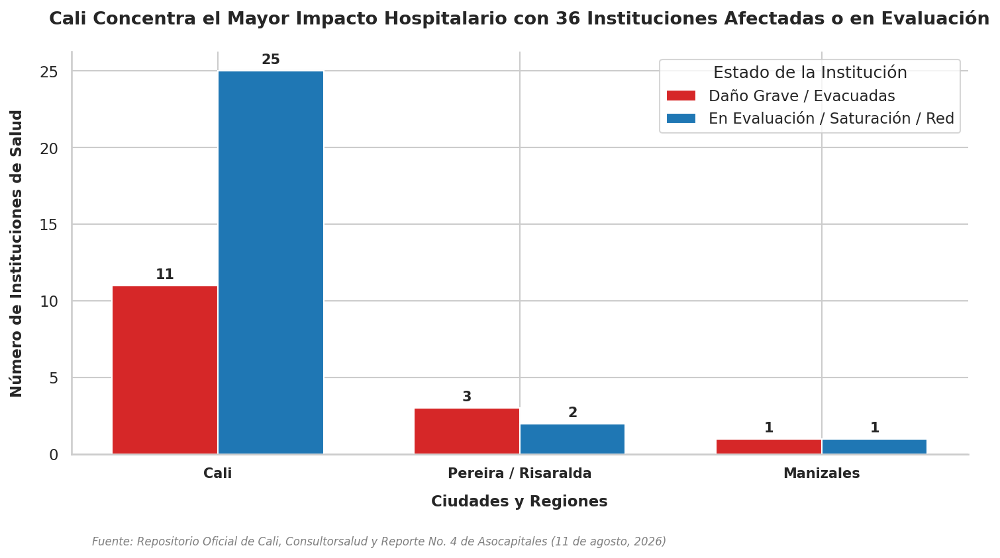

# Cali Concentra el Mayor Impacto Hospitalario con 36 Instituciones Afectadas o en Evaluación

A raíz del sismo de magnitud 7,4 Mw registrado el 10 de agosto de 2026, la red de prestación de servicios de salud en el occidente colombiano se encuentra bajo una presión extrema. El análisis consolidado de la infraestructura hospitalaria revela que Santiago de Cali registra el mayor número de afectaciones sanitarias del país, seguida de Pereira y Manizales.

## Hallazgos Clave

1. **Colapso y Evacuación en Cali**: La ciudad registra **11 instituciones con daños graves o evacuación total**, incluyendo el colapso parcial de una de las alas del Hospital Universitario del Valle (HUV) —donde se habilitaron carpas en los jardines para la atención médica— y la evacuación de 7 IPS cerradas de emergencia. Adicionalmente, **25 IPS están bajo inspección técnica** por agrietamientos o daños en evaluación.
2. **Saturación Crítica en Pereira**: Pereira y La Virginia enfrentan la **saturación al 100% de la ocupación** de sus centros principales (Hospital Universitario San Jorge y Hospital San Pedro y San Pablo), obligando a establecer zonas de expansión y solicitar personal médico de refuerzo. Además, se registra el colapso de una pared en la Clínica Los Nevados y la evacuación total de la clínica Noé por daños estructurales severos.
3. **Afectaciones en Manizales**: En la capital de Caldas, el Hospital Universitario Santa Sofía reporta daños en diversas áreas, y se registra la interrupción del servicio en la red de dispensación de medicamentos regional (Disfarma).

## Resumen de la Red Hospitalaria Afectada

| Ciudad / Región | Daño Grave / Evacuadas | En Evaluación / Saturadas / Red | Impacto Total |
| :--- | :---: | :---: | :---: |
| **Cali** | 11 | 25 | **36** |
| **Pereira / Risaralda** | 3 | 2 | **5** |
| **Manizales** | 1 | 1 | **2** |

*(Nota: En el departamento de Chocó se reporta una alta demanda asistencial y necesidad crítica de envío de componentes sanguíneos para Quibdó, aunque no se detalla una cifra exacta de instituciones físicas con daños).*

## Metodología

Los datos recopilados proceden de los balances oficiales provistos por la Secretaría de Salud Pública de Cali, comités locales de gestión del riesgo, reportes de la red nacional gremial de salud y el Reporte Técnico de Situación No. 4 emitido por la Asociación Colombiana de Ciudades Capitales (Asocapitales) con corte al 11 de agosto de 2026.