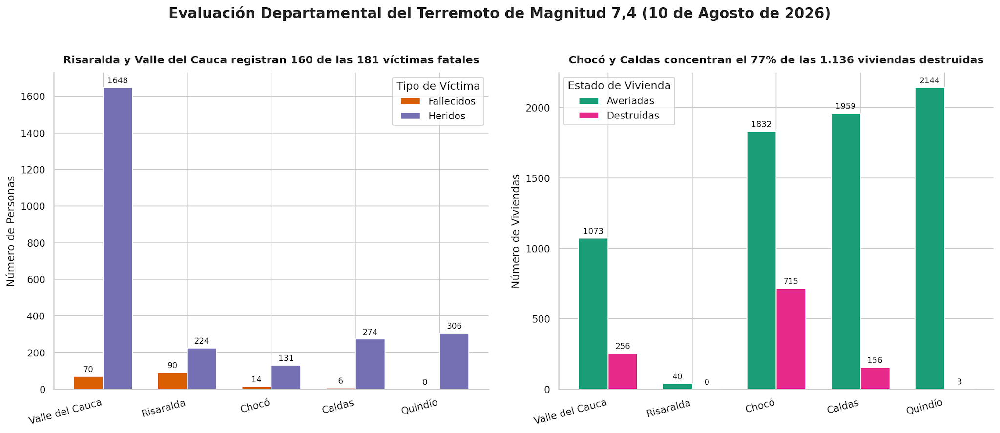

# Risaralda, Valle y Chocó Concentran la Mayor Devastación y Pérdidas del Terremoto de Magnitud 7,4

El balance consolidado a nivel departamental tras el sismo de magnitud 7,4 Mw del 10 de agosto de 2026 revela un patrón de afectación muy diferenciado según el territorio [533]. Mientras Risaralda y Valle del Cauca sufren la mayor cantidad de pérdidas humanas [535, 537], Chocó y Caldas concentran el mayor impacto físico sobre la infraestructura de vivienda [539, 541].

## Hallazgos Clave

1. **Risaralda lidera en pérdidas fatales**: Con un total de **90 fallecidos**, Risaralda es el departamento con mayor número de víctimas mortales, concentradas principalmente en su capital, Pereira (79 víctimas) [535, 536].
2. **Valle del Cauca registra el 63 % de los heridos**: El departamento del Valle del Cauca reporta **1.648 personas heridas** de las 2.595 registradas a nivel nacional, además de **171 personas desaparecidas** [534, 537].
3. **Chocó y Caldas concentran el 77 % de la destrucción de viviendas**: De las 1.136 viviendas destruidas a nivel nacional, **715 están en Chocó** (zona epicentral) y **156 en Caldas** [534, 539, 541]. 
4. **Quindío registra la mayor cantidad de afectaciones parciales**: Con **2.144 viviendas averiadas**, Quindío es el departamento con mayor afectación superficial de bienes, aunque no registra pérdidas de vidas en los reportes preliminares consolidados [543].

## Consolidado Técnico de Daños por Departamento

| Departamento | Fallecidos | Heridos | Viviendas Averiadas | Viviendas Destruidas | Edificios Colapsados |
| :--- | :---: | :---: | :---: | :---: | :---: |
| **Risaralda** | 90 | 224 | 40 | 0 | 0 |
| **Valle del Cauca** | 70 | 1.648 | 1.073 | 256 | 44 |
| **Chocó** | 14 | 131 | 1.832 | 715 | 0 |
| **Caldas** | 6 | 274 | 1.959 | 156 | 4 |
| **Quindío** | 0 | 306 | 2.144 | 3 | 0 |
| **Antioquia** | 1 | 0 | 857 | 0 | 0 |
| **Tolima** | 0 | 0 | 234 | 6 | 0 |

*(Nota: Datos preliminares recopilados por la Unidad Nacional para la Gestión del Riesgo de Desastres - UNGRD, con corte al 11 de agosto de 2026 [534]).*

## Metodología y Fuentes

Este análisis compara de manera agregada los reportes territoriales emitidos por los consejos departamentales de gestión del riesgo y la UNGRD [534, 545]. Permite corregir el sesgo de los balances municipales previos, que al enfocarse exclusivamente en las capitales, omitían la devastación de áreas rurales y municipios aledaños de Valle, Chocó y Risaralda [539].
