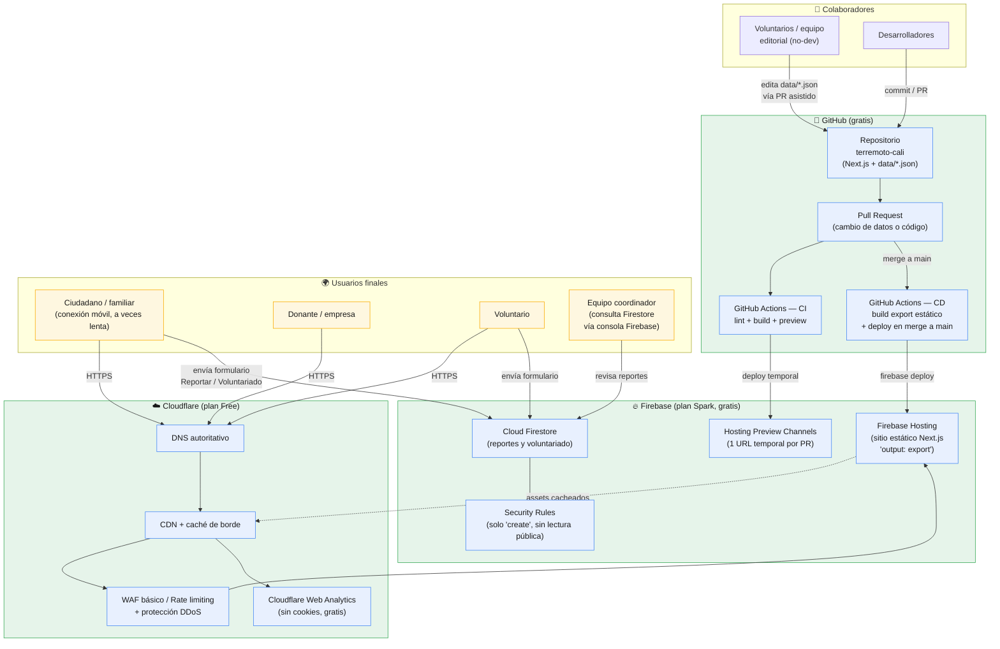

# Arquitectura Propuesta — Costo Operativo $0

> Stack obligatorio del proyecto: **GitHub + GitHub Actions (CI/CD) + Firebase Hosting + Cloudflare (CDN/DNS)**. El resto de piezas se eligieron exclusivamente entre herramientas con **capa gratuita permanente** (no trials), dado que el proyecto no tiene presupuesto.

---

## 1. Diagrama de arquitectura (Mermaid)

---

## 2. Flujo de despliegue (CI/CD)

1. Un colaborador (dev o editor de contenido) abre un **Pull Request** contra `main`, ya sea cambiando código (`app/`, `components/`) o datos (`data/*.json`).
2. **GitHub Actions (CI)** corre automáticamente: `npm ci`, `lint`, `build` con `next build && next export`, y publica el resultado en un **Firebase Hosting Preview Channel** (URL temporal, expira en días) para que el equipo revise el cambio antes de aprobarlo — clave para no publicar cifras erróneas.
3. Al aprobar y hacer **merge a `main`**, **GitHub Actions (CD)** repite el build y ejecuta `firebase deploy --only hosting` contra el canal `live`.
4. Firebase Hosting sirve los archivos estáticos con HTTPS gratuito.
5. **Cloudflare** se configura como DNS autoritativo del dominio (o subdominio, ej. `ayuda.hypeideas.co`) apuntando a Firebase Hosting, en modo *proxied* (nube naranja) para obtener CDN, caché de borde, protección DDoS/WAF básica y analítica sin cookies — todo en el plan Free.
6. Los formularios de **Reportar** y **Voluntariado** escriben directo desde el navegador al **Cloud Firestore** vía el SDK cliente de Firebase (no requiere backend ni funciones de pago), protegidos por reglas de seguridad que permiten `create` público pero **no lectura pública** — solo el equipo coordinador consulta desde la consola de Firebase o un panel simple más adelante.

---

## 3. Por qué cada pieza (y qué la reemplaza si hiciera falta)

| Capa | Herramienta | Por qué | Alternativa gratis si se necesita |
|---|---|---|---|
| Control de versiones / colaboración | **GitHub** (requerido) | Estándar, gratis para repos públicos, historial auditable de cada cambio de dato (importante en una crisis con cifras cambiantes) | — |
| CI/CD | **GitHub Actions** (requerido) | 2.000 min/mes gratis en repos privados (ilimitado en públicos), se integra nativo con GitHub | — |
| Hosting | **Firebase Hosting** (requerido) | Plan Spark gratis: hosting estático + SSL + hosting preview channels + CDN propio de Google | — |
| CDN / DNS / seguridad | **Cloudflare** (requerido) | Plan Free: CDN global, DNS, WAF básico, protección DDoS, analítica sin cookies | — |
| Base de datos de formularios | **Cloud Firestore** (plan Spark) | Escritura directa desde el cliente sin backend; cuota gratuita diaria (50k lecturas / 20k escrituras) más que suficiente para el volumen esperado | Google Sheets + Apps Script (más simple pero menos robusto) |
| Contenido dinámico (cifras, albergues, hospitales) | **Archivos `data/*.json` versionados en Git** | $0, auditable, editable vía PR, no depende de un CMS de pago | Headless CMS free tier (ej. Decap CMS sobre el mismo repo) si se necesita UI de edición |
| Analítica | **Cloudflare Web Analytics** | Gratis, sin cookies, no afecta rendimiento | Plausible/GA4 free tier |
| Monitoreo de disponibilidad | **GitHub Actions programado (cron) + UptimeRobot free** | Chequeo periódico gratis del sitio (ver `04_monitoring`) | Better Uptime free tier |
| Notificación de nuevos reportes (Fase 2) | **EmailJS / Web3Forms (free tier)** | Envío de notificación al equipo coordinador sin backend de pago | Cloudflare Email Workers |

**Costo total mensual estimado: $0**, dentro de los límites de las capas gratuitas descritas (más que suficientes para el tráfico esperado de una emergencia regional).

---

## 4. Seguridad y confiabilidad de los datos

- **Nadie escribe directo a `main`**: todo cambio de dato pasa por PR + CI, evitando publicar una cifra sin revisión (aprendizaje directo del discovery: las cifras de fallecidos variaron de 28 a 95 en las primeras horas).
- **Firestore Security Rules** restringen los formularios públicos a solo-escritura (`allow create`), impidiendo que cualquier visitante lea reportes de otras personas (dato sensible: ubicación de personas atrapadas/desaparecidas).
- **Cloudflare WAF/Rate limiting** protege los formularios contra spam o abuso automatizado.
- **Firebase Hosting Preview Channels** permiten validar visualmente cada cambio antes de que llegue a producción.
- **Historial de Git = auditoría**: se puede reconstruir en cualquier momento "qué decía el sitio a las 3pm" — clave para transparencia pública.

## 5. Escalabilidad

El sitio es 100% estático (HTML/JS/CSS pre-generado), por lo que el "tráfico de lectura" (la inmensa mayoría) lo absorbe la CDN de Cloudflare sin tocar Firebase ni Firestore. Solo las escrituras de formularios tocan Firestore, cuyo límite gratuito diario está muy por encima del volumen esperado de reportes/voluntarios. Si el proyecto creciera más allá de las capas gratuitas, el único cambio necesario sería pasar Firebase de plan **Spark → Blaze** (pago por uso, sigue siendo muy económico) sin tocar el resto de la arquitectura.
